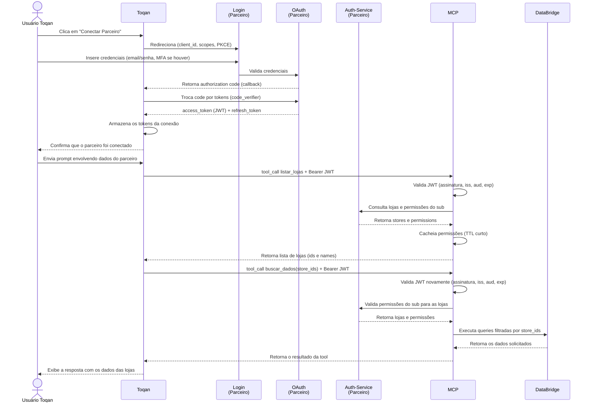

# Fluxo OAuth

Esta seção documenta o fluxo de **autenticação e autorização** usado para conectar um **Parceiro** (software de restaurante) ao **Toqan** e permitir acesso seguro aos dados via MCP.

O fluxo usa **OAuth 2.0** com **PKCE** e tokens **JWT**.

## Participantes

| Participante | Descrição |
|---|---|
| Usuário Toqan | Pessoa que opera o Toqan e conecta o parceiro |
| Toqan | Agente que consome os dados via MCP |
| Login (Parceiro) | Página de login do software de restaurante |
| OAuth (Parceiro) | Authorization server do parceiro |
| Auth-Service (Parceiro) | Serviço de autorização do parceiro |
| MCP | Servidor MCP do ecossistema que expõe as tools |
| DataBridge | Camada de acesso aos dados (executa as queries) |

> **Nota:** "Parceiro" representa qualquer software de restaurante integrado (por exemplo, Saipos).

## Diagrama de sequência

## Etapas do fluxo

### 1. Conexão do parceiro

1. **Usuário → Toqan:** clica em "Conectar Parceiro".
2. **Toqan → Login:** redireciona o usuário enviando `client_id`, `scopes` e os parâmetros do fluxo **PKCE**.
3. **Usuário → Login:** insere credenciais (email/senha) e realiza MFA se necessário.
4. **Login → OAuth:** valida as credenciais fornecidas.
5. **OAuth → Toqan:** retorna um **authorization code** via callback.
6. **Toqan → OAuth:** troca o authorization code por tokens usando o `code_verifier` do PKCE.
7. **OAuth → Toqan:** retorna `access_token` (JWT) e `refresh_token`.
8. **Toqan:** armazena os tokens da conexão com o parceiro.
9. **Toqan → Usuário:** informa que o parceiro foi conectado.

### 2. Pergunta sobre dados do parceiro

10. **Usuário → Toqan:** envia um prompt que envolve dados do parceiro.
11. **Toqan → MCP:** executa `tool_call listar_lojas` com `Bearer JWT`.
12. **MCP:** valida o JWT (assinatura, `iss`, `aud`, `exp`).
13. **MCP → Auth-Service:** consulta lojas e permissões do usuário/sub.
14. **Auth-Service → MCP:** retorna `stores` e `permissions`.
15. **MCP:** armazena/cacheia as permissões por um **TTL curto**.
16. **MCP → Toqan:** retorna a lista de lojas (`ids` e `names`).

### 3. Consulta dos dados

17. **Toqan → MCP:** executa `tool_call buscar_dados(store_ids)` com `Bearer JWT`.
18. **MCP:** valida novamente o JWT (assinatura, `iss`, `aud`, `exp`).
19. **MCP → Auth-Service:** valida as permissões do `sub` para as lojas solicitadas (ou usa o cache).
20. **Auth-Service → MCP:** retorna as lojas e permissões.
21. **MCP → DataBridge:** executa as queries necessárias, filtradas pelos `store_ids` autorizados.
22. **DataBridge → MCP:** retorna os dados solicitados.
23. **MCP → Toqan:** retorna o resultado da execução da tool.
24. **Toqan → Usuário:** exibe a resposta com os dados das lojas.

## Segurança

- **PKCE obrigatório** para clientes públicos.
- **Validação de JWT** a cada chamada: assinatura, `iss`, `aud` e `exp`.
- **Cache de permissões com TTL curto**, para evitar consultas repetidas ao Auth-Service sem abrir mão de revogação rápida.
- **Filtro por `store_ids` autorizados** no DataBridge — o MCP nunca consulta lojas fora do escopo do `sub`.
- Secrets guardados apenas em secret manager; nunca versionados.

## Referências

- [RFC 6749 — OAuth 2.0](https://datatracker.ietf.org/doc/html/rfc6749)
- [RFC 7636 — Proof Key for Code Exchange (PKCE)](https://datatracker.ietf.org/doc/html/rfc7636)
- [RFC 7519 — JSON Web Token (JWT)](https://datatracker.ietf.org/doc/html/rfc7519)
