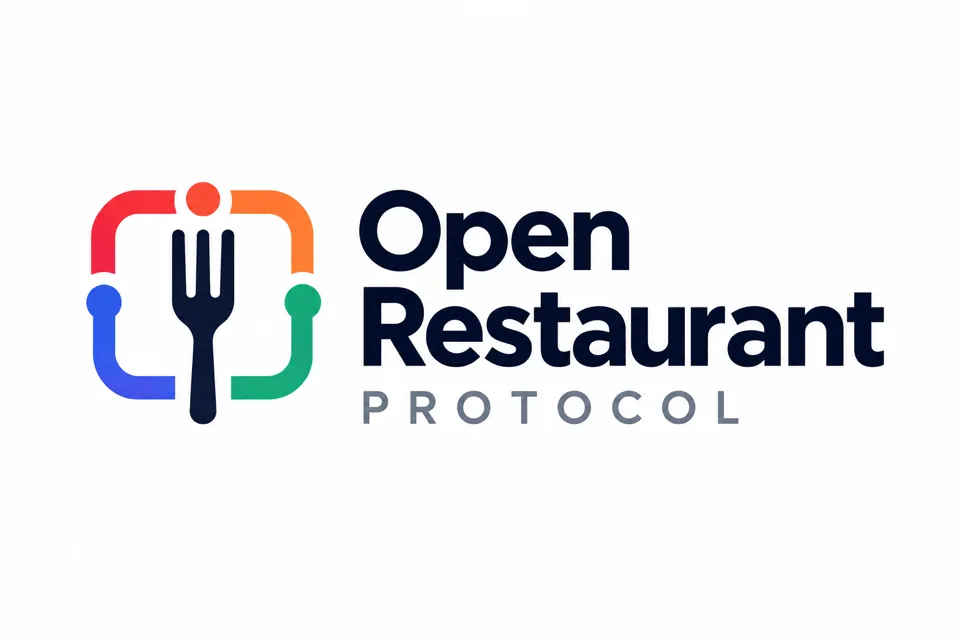

{ width="480" }

# Open Restaurant Protocol

Um padrão aberto para integrações entre sistemas do ecossistema de restaurantes — APIs, agentes, MCPs e autenticação.

## Overview

O **Open Restaurant Protocol** (ORP) define como sistemas se conectam e trocam dados de forma segura e padronizada. Ele cobre três pilares:

- **Autenticação** — o fluxo OAuth 2.0 que autoriza o acesso aos dados.
- **Descoberta** — como authorization servers e recursos protegidos são descobertos automaticamente.
- **Contratos de Dados** — a estrutura que cada domínio de dados deve seguir ao expor seus dados.

## Key Details

- Baseado no protocolo **MCP** (Model Context Protocol) para exposição de ferramentas e dados.
- Autenticação via **OAuth 2.0** com **authorization code + PKCE**.
- Descoberta automática via **RFC 8414** (Authorization Server Metadata), **RFC 9728** (Protected Resource Metadata) e **RFC 7591** (Dynamic Client Registration).
- Versionamento semântico do protocolo (v1, v2, ...), com acesso a versões anteriores via seletor de versão.

## Versões

- **v1** — lançamento inicial (atual).

## Learn More

- [Autenticação](auth/oauth.md) — o fluxo OAuth e os requisitos para integrar.
- [Discovery](auth/discovery.md) — descoberta automática de authorization servers e recursos protegidos.
- [Contratos de Dados](data-contracts/index.md) — a estrutura de um contrato de domínio.
- [Integrações](integrations/mcp.md) — como conectar via MCP.
